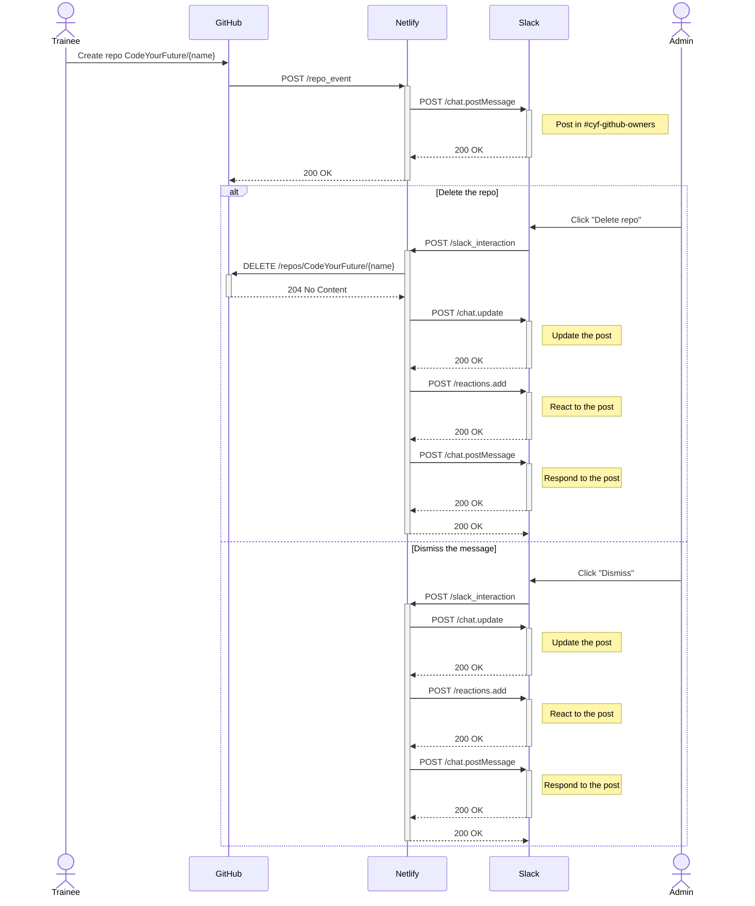

# CYF GitBot

[![Node.js CI][ci-badge]][ci-link]

Integrating GitHub and Slack via Netlify.

## What is this?

Trainees often accidentally create repositories in the CYF GitHub organization. This leads to lots of excess repos and
makes it hard to manage the org.

A [webhook][github-webhooks] in GitHub is configured to send all relevant events (_"Repository created, deleted,
archived, unarchived, publicized, privatized, edited, renamed, or transferred."_) in the CYF org to a [Netlify
function][netlify-functions] (in CYF's account).

The function in turn interacts with Slack to post messages notifying organization owners of any new repository,
allowing them to review and (if necessary) delete the new repository.

## Architecture

The sequence diagram below shows the series of events and calls.

## Configuration

The Netlify functions require the following environment variables:

- `GITHUB_TOKEN`: Token used to delete repos in GitHub, a [fine-grained token][github-token]:
    - **Resource owner** should be CodeYourFuture
    - **Repository access** should be "All repositories"
    - **Repository permissions** should be:
        - **Administration**: read and write (to allow repository deletion)
        - **Metadata**: read (this is set by default)
- `GITHUB_WEBHOOK_SECRET`: Secret used to verify webhook calls from GitHub
- `SLACK_CHANNEL`: The channel to post messages in (currently [#cyf-github-owners][slack-channel])
- `SLACK_SIGNING_SECRET`: Secret used to verify webhook calls from Slack
- `SLACK_TOKEN`: Token used to post messages to Slack (with scopes `chat:write` and `reactions:write`)

[ci-badge]: https://github.com/CodeYourFuture/gitbot/actions/workflows/push.yml/badge.svg
[ci-link]: https://github.com/CodeYourFuture/gitbot/actions/workflows/push.yml
[github-token]: https://docs.github.com/en/authentication/keeping-your-account-and-data-secure/creating-a-personal-access-token#creating-a-fine-grained-personal-access-token
[github-webhooks]: https://docs.github.com/en/developers/webhooks-and-events/webhooks/about-webhooks
[netlify-functions]: https://functions.netlify.com/
[slack-channel]: https://codeyourfuture.slack.com/archives/C03LSS9TNRW
