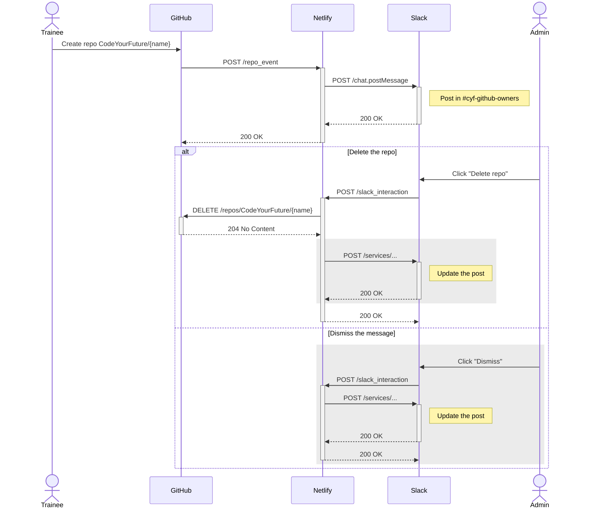

# CYF GitBot

Integrating GitHub and Slack via Netlify.

## What is this?

Trainees often accidentally create repos in the CYF GitHub organization. This leads to lots of excess repos and makes
it hard to manage the org.

A [webhook](https://docs.github.com/en/developers/webhooks-and-events/webhooks/about-webhooks) in GitHub is
configured to send all repo events (_"Repository created, deleted, archived, unarchived, publicized, privatized,
edited, renamed, or transferred."_) in the CYF org to a [Netlify function](https://functions.netlify.com/) (in CYF's
account).

The function in turn interacts with Slack to post messages notifying org owners of any new repository, allowing them
to review and (if necessary) delete the new repo.

## Architecture

The sequence diagram below shows the series of events and calls.

_(Note the grey section is currently aspirational.)_

## Configuration

The Netlify functions require the following environment variables:

- `GITHUB_TOKEN`: Token used to delete repos in GitHub
- `GITHUB_WEBHOOK_SECRET`: Secret used to verify webhook calls from GitHub
- `SLACK_CHANNEL`: The channel to post messages in (currently [#cyf-github-owners](https://codeyourfuture.slack.com/archives/C03LSS9TNRW))
- `SLACK_SIGNING_SECRET`: Secret used to verify webhook calls from Slack
- `SLACK_TOKEN`: Token used to post messages to Slack
